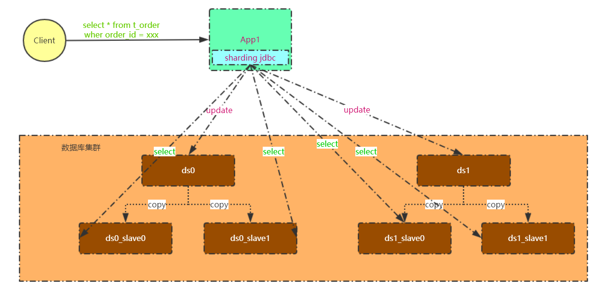

[TOC]

# 读写分离测试

## 准备一个Mysql集群

http://note.youdao.com/noteshare?id=afb054d31ab7b89faef593f4ff734468&sub=2987691F751C4C469E3B9F599E5BAD9A

## 验证

停止master
```
docker stop mysql-cluster_mysql-master_1
```
**测试 添加账号**，失败
```
Whitelabel Error Page
This application has no explicit mapping for /error, so you are seeing this as a fallback.

Tue May 07 23:12:20 CST 2019
There was an unexpected error (type=Internal Server Error, status=500).
could not prepare statement; nested exception is org.hibernate.exception.JDBCConnectionException: could not prepare statement
```

**测试查询所有账号**, 成功

http://localhost:8080/userinfo

```
[{"id":1,"name":"wuhulala"},{"id":2,"name":"wuhulala2"}]
```

**重启master**

新增一个用户3  http://localhost:8080/userinfo/hlx

再次进行查询，会存在一定的延迟
```
[{"id":1,"name":"wuhulala"},{"id":2,"name":"wuhulala2"}]
```
稍等一下
```
[{"id":1,"name":"wuhulala"},{"id":2,"name":"wuhulala2"},{"id":3,"name":"hlx"}]
```

---

# 分片测试

## 停止上一节的集群,关闭复制
```
mysql -uroot -pxxx

SQL> stop slave
```

## 创建数据库表

分别在数据库1 和 数据库2 执行
```sql
DROP TABLE  IF EXISTS userinfo0;
CREATE TABLE `userinfo0` (
  `id` BIGINT(16) NOT NULL,
  `name` VARCHAR(255) DEFAULT NULL,
  PRIMARY KEY (`id`)
)
DROP TABLE  IF EXISTS userinfo1;
CREATE TABLE `userinfo1` (
  `id` BIGINT(16) NOT NULL,
  `name` VARCHAR(255) DEFAULT NULL,
  PRIMARY KEY (`id`)
)
```

## 设置自增策略
Snowflake 算法

> snowflake是Twitter开源的分布式ID生成算法，结果是一个long型的ID。其核心思想是：使用41bit作为毫秒数，10bit作为机器的ID（5个bit是数据中心，5个bit的机器ID），12bit作为毫秒内的流水号（意味着每个节点在每毫秒可以产生 4096 个 ID），最后还有一个符号位，永远是0。snowflake算法可以根据自身项目的需要进行一定的修改。比如估算未来的数据中心个数，每个数据中心的机器数以及统一毫秒可以能的并发数来调整在算法中所需要的bit数。
### 优点：

不依赖于数据库，灵活方便，且性能优于数据库。
ID按照时间在单机上是递增的。

### 缺点：
在单机上是递增的，但是由于涉及到分布式环境，每台机器上的时钟不可能完全同步，也许有时候也会出现不是全局递增的情况。

### 参考资料: 

* https://www.jianshu.com/p/a0a3aa888a49
* https://www.sohu.com/a/232008315_453160
* https://www.cnblogs.com/relucent/p/4955340.html
### id全是偶数
由于跨毫秒后，最后的sequence累加就会清零，导入末位为偶数。如果id生成不频繁，则生成的就是全是偶数

## 配置规则

```yaml
## 分片策略
dataSources:
  ds0: !!com.zaxxer.hikari.HikariDataSource
    driverClassName: com.mysql.cj.jdbc.Driver
    jdbcUrl: jdbc:mysql://localhost:33065/sharding-jdbc?useUnicode=true&characterEncoding=utf-8&useSSL=false
    username: root
    password: root
  ds1: !!com.zaxxer.hikari.HikariDataSource
    driverClassName: com.mysql.cj.jdbc.Driver
    jdbcUrl: jdbc:mysql://localhost:33066/sharding-jdbc?useUnicode=true&characterEncoding=utf-8&useSSL=false
    username: root
    password: root
shardingRule:
  tables:
    userinfo:
      actualDataNodes: ds${0..1}.userinfo${0..1}
      databaseStrategy:
        inline:
          shardingColumn: id
          algorithmExpression: ds${id % 2}
      tableStrategy:
        inline:
          shardingColumn: name
          algorithmExpression: userinfo${name.length() % 2}
```
此分片规则就是，用户id根据奇数偶数判断在哪一个库里面，然后再根据名称的长度分布在哪个表里
- 如：{id=1,name=wuhulala} 就是在 ds1库 的 userinfo0 表里面
- 如：{id=2,name=hlx} 就是在 ds0库 的 userinfo1 表里面

```java
  /**
     * 配置分片数据源
     *
     */
    @Bean
    public DataSource dataSource() throws FileNotFoundException, SQLException, IOException {
        return ShardingDataSourceFactory.createDataSource(ResourceUtils.getFile("classpath:sharding-jdbc-shardingRule.yml"));
    }
```
## 测试

http://localhost:8080/userinfo/wuhulala

然后查看数据库，就可以看到了。

# 读写分离&分片测试

## 环境搭建

先搭建如下的mysql集群



## 
